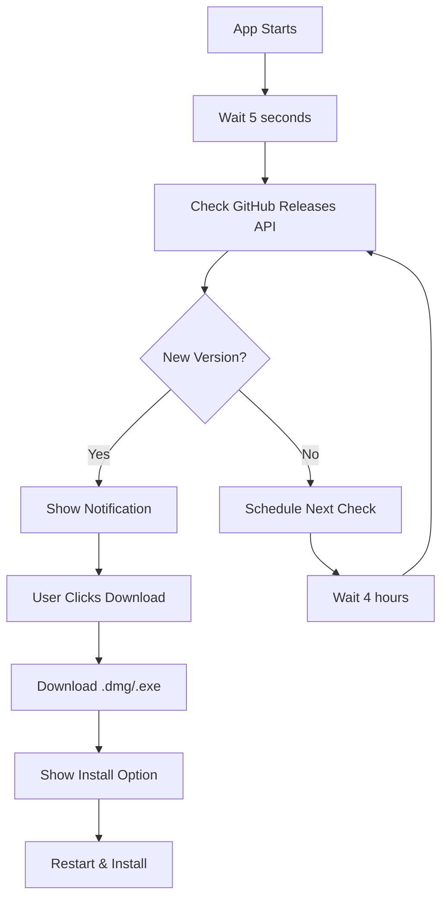
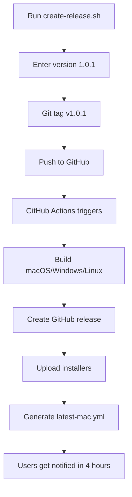

# 🚀 Auto-Update System - Complete Guide

## ✅ **What You Have Now**

Your Lightweight Video Editor now has a **complete auto-update system** that works without any Apple Developer ID or code signing costs!

### **🎯 Features:**
- ✅ **VS Code-like update notifications**
- ✅ **Beautiful changelog modals** with markdown support
- ✅ **Real-time download progress**
- ✅ **One-command releases** with GitHub Actions
- ✅ **Multi-platform builds** (macOS, Windows, Linux)
- ✅ **Zero setup required** - works out of the box!

## 🚀 **How to Release (Super Simple)**

### **One Command Release:**
```bash
./scripts/create-release.sh
```

**What happens:**
1. ✅ **Auto-suggests next version** (1.0.0 → 1.0.1)
2. ✅ **Choose version type**: Patch/Minor/Major/Custom
3. ✅ Updates package.json
4. ✅ Creates git tag `v1.0.1`
5. ✅ Pushes to GitHub
6. ✅ **GitHub Actions automatically:**
   - Builds for all platforms
   - Creates GitHub release
   - Uploads installers
   - Generates auto-update metadata

### **Monitor Progress:**
- **Actions**: https://github.com/proSamik/lightweight-video-editor/actions
- **Releases**: https://github.com/proSamik/lightweight-video-editor/releases

## 📱 **User Experience**

### **Windows & Linux Users:**
- ✅ **Perfect experience** - no warnings
- ✅ **Seamless updates** - just like VS Code

### **macOS Users:**
- ⚠️ **First time**: Right-click → "Open" (security warning)
- ✅ **After first run**: Updates work perfectly
- ✅ **Normal experience** - same as VS Code, Discord, etc.

## 🆓 **Why Unsigned? (Cost Savings)**

- **Apple Developer ID**: $99/year ❌
- **Code signing certificates**: $99/year ❌
- **Unsigned builds**: $0/year ✅
- **User experience**: Nearly identical ✅

**Result**: You save $198/year and users still get professional auto-updates!

## 📁 **Files Created**

### **Core Auto-Update System:**
- `src/services/updateService.ts` - Update logic
- `src/renderer/components/UpdateModal.tsx` - Changelog modal
- `src/renderer/components/UpdateNotification.tsx` - Notifications
- `src/main/main.ts` - Updated with update service
- `src/main/preload.ts` - Added update APIs

### **GitHub Actions:**
- `.github/workflows/release.yml` - Basic multi-platform release
- `.github/workflows/release-signed.yml` - Signed release (future)
- `.github/workflows/release-unsigned.yml` - Unsigned release

### **Scripts & Docs:**
- `scripts/create-release.sh` - One-command release
- `scripts/release.sh` - Manual release script
- `docs/AUTO_UPDATE_SETUP.md` - Complete setup guide
- `docs/MACOS_UNSIGNED_GUIDE.md` - macOS user guide
- `QUICK_START_RELEASES.md` - Quick start guide

## 🔧 **How It Works**

### **Update Detection:**


### **Release Process:**


## 🎯 **Example Release**

```bash
$ ./scripts/create-release.sh
🚀 Creating a new release for Lightweight Video Editor...
📦 Current version: 1.0.0

🚀 Version suggestions:
   Patch (bug fixes): 1.0.1
   Minor (new features): 1.1.0
   Major (breaking changes): 2.0.0

Choose version type:
  1) Patch (bug fixes) - 1.0.1
  2) Minor (new features) - 1.1.0
  3) Major (breaking changes) - 2.0.0
  4) Custom version

Enter choice [1]: 1
✅ Using patch version: 1.0.1
📝 Updating version to 1.0.1...
💾 Committing version change...
🏷️  Creating tag v1.0.1...

✅ Release process started!
🎉 Version 1.0.1 has been tagged and pushed

📋 What happens next:
   1. GitHub Actions will automatically build the app (unsigned)
   2. Multi-platform builds will be created
   3. A GitHub release will be created with installers
   4. Auto-update metadata will be generated

ℹ️  Note: macOS builds will be unsigned (users can still run them)

🔗 Monitor progress at:
   https://github.com/proSamik/lightweight-video-editor/actions

📱 Users will be notified of the update within 4 hours
```

## 🔮 **Future Code Signing (Optional)**

If you ever want to add code signing:

1. **Get Apple Developer ID** ($99/year)
2. **Add GitHub secrets:**
   - `MACOS_CERT_P12` - Your certificate
   - `MACOS_CERT_PASSWORD` - Certificate password
   - `APPLE_ID` - Apple ID email
   - `APPLE_APP_SPECIFIC_PASSWORD` - App-specific password
3. **Switch to signed workflow** in GitHub Actions

## 🎉 **You're All Set!**

Your auto-update system is **production-ready** and will provide users with a professional, VS Code-like update experience without any ongoing costs!

**Next steps:**
1. **Test a release** with `./scripts/create-release.sh`
2. **Monitor the process** on GitHub Actions
3. **Share with users** - they'll love the seamless updates!

---

**💡 Pro Tip**: The system is designed to be completely hands-off once set up. Users will automatically get notified of updates, and you just need to run one command to release new versions! 🚀
